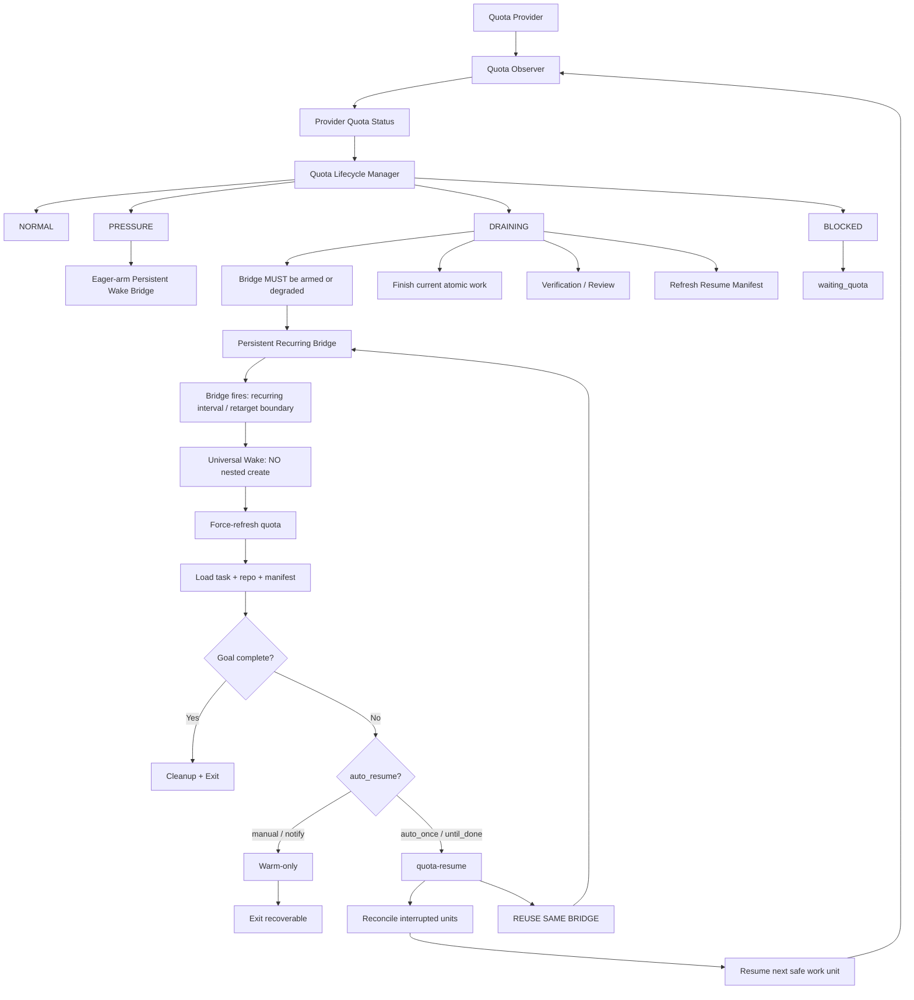

# GLM-Conductor v2.2：Quota Continuity Control Loop Closure

> **文档类型**：Agent Implementation Plan / Architecture & Release Specification  
> **目标版本**：v2.2.0  
> **基线版本**：v2.1.0 stable  
> **基线提交**：`0cddbf3a68b49d2c73c298f5945cc9e42ad77f6a`  
> **适用仓库**：`https://github.com/Chengy257/glm-conductor`  
> **状态**：Implementation Ready  
> **语言**：中文  
> **核心主题**：Quota Observer、Adaptive Heartbeat、DRAINING、Wake Bridge、Reset-boundary Activation、Authorized Resume、Continuation Obligation  
> **冲突优先级（C0 冻结，2026-09-02）**：本文件与《GLM-Conductor-v2.2-Quota-Control-Plane-Architecture-Correction-and-Agent-Implementation-Plan.md》冲突时，**以该修正文件为准**。旧 M6/M7/M8/M10+ 规格按其 §26 C 序列重写执行（C0→C1a→C2→C1b→C3 骨架→P0-QP→C4→C5+）；wu-22-06/07/08/10/11/12 保留历史状态，不再按原规格实施。本文件保留为历史设计证据与 Phase0/SCHED/测试矩阵引用源，不再单独维护演进。

---

## 0. 文档目的

GLM-Conductor v2.1 已经完成了较完整的 runtime integrity closure：包括 quota provider 查询、额度四态解析、dispatch budget 折算、`quota-exhausted` / `quota-resume`、authorized resume、window budget、Resume Manifest、SessionStart 恢复注入、agent reconcile、permit / lease / verification / review receipt 等能力。

但在真实长程任务 dogfood 中仍暴露出一个关键问题：

> **“具备恢复能力”不等于“恢复链一定被建立”。**

典型场景：

- 当前任务是长程任务；
- GLM Coding Plan 5h 窗口已剩余约 24%；
- 用户已经授权自动检测、跨窗口继续执行；
- runtime 已能查询当前 quota；
- 但 Agent 未提前创建 scheduled wake；
- quota 耗尽后模型失去执行能力；
- 此时才意识到应该创建 continuation 已经太晚；
- 最终只能依赖用户再次唤醒或临时补建 automation。

因此 v2.2 的目标不是继续增加 quota 原语，而是：

> **把现有 quota、continuity、automation、resume 原语闭合成不可绕过的控制回路。**

本版本核心要解决三个问题：

1. **额度状态如何持续被观察，而不是仅在少数事件点采样；**
2. **额度耗尽前，如何强制建立跨窗口 Wake Bridge；**
3. **下一额度窗口触发后，如何自动区分 warm-only 与 resume，并安全接续任务。**

---

# 1. v2.1 当前能力基线

当前仓库已经具备以下核心能力，v2.2 应优先复用，不应重新实现平行系统。

## 1.1 Quota Provider 与四态判断

现有目录：

```text
plugins/glm-conductor/runtime/quota/
├── _http.py
├── bigmodel.py
├── credentials.py
├── parser.py
├── provider.py
├── report.py
├── resolver.py
├── scheduler.py
└── zai.py
```

当前 quota 基础状态：

```text
AVAILABLE
PRESSURE
EXHAUSTED
UNKNOWN
```

当前 `scheduler.py` 已支持：

- quota snapshot 标准化；
- remaining / used percentage；
- 多窗口；
- EXHAUSTED 时：
  - `resume_at = max(blocking reset_at) + grace`
- reset 时间未知时：
  - `periodic_fallback`
- wake 后：
  - 强制 refresh quota。

当前 `PRESSURE` 默认阈值约为剩余 10%。

---

## 1.2 Execution Policy

当前 `execution_policy.py` 已定义：

```text
continuity.mode:
  foreground
  resumable
  idle

auto_resume:
  manual
  notify
  auto_once
  until_done
```

并已有：

```text
max_quota_windows
consumed_quota_windows
authorization.source
authorization.confirmed_at
```

默认策略仍偏保守：

```text
continuity.mode = resumable
auto_resume = manual
max_quota_windows = 0
```

这意味着：

> `resumable` 只代表“可恢复”，并不等于“自动恢复”。

---

## 1.3 Quota Runtime CLI

当前已经存在：

```text
quota-resolve
quota-exhausted
quota-resume
wake-prompt
wake-record
```

典型流程：

```text
quota EXHAUSTED
    ↓
quota-exhausted
    ↓
runtime 计算 wake 建议
    ↓
主 Agent 创建 scheduled task / automation
    ↓
wake-record
    ↓
reset 后 wake
    ↓
quota-resume
```

问题在于：

```text
“创建 automation”
```

以及：

```text
“创建成功后 wake-record”
```

仍主要依赖 Agent 纪律。

---

## 1.4 Continuity / Resume

当前已有：

```text
.glm-conductor/tasks/<task-id>/
├── checkpoint.md
├── state.json
├── events.jsonl
└── manifest.json
```

并已有：

- SessionStart 自动恢复注入；
- Resume Manifest；
- repository > checkpoint；
- agent-run reconcile；
- `quota_interrupted_from`；
- running unit 四分恢复：
  - reuse_result
  - resume_with_progress
  - redispatch_clean
  - manual_ruling

这些机制应保留并作为 v2.2 Resume Controller 的底座。

---

# 2. 真实问题定义

## 2.1 当前控制回路断点

当前实际上是：

```text
quota observation
      ↓
quota evaluation
      ↓
runtime recommendation
      ↓
Agent SHOULD create automation
      ↓
Agent SHOULD record automation
      ↓
future wake
```

其中两个 `SHOULD` 都可能被模型忽略。

v2.2 应变成：

```text
quota observation
      ↓
quota lifecycle decision
      ↓
continuation obligation
      ↓
wake MUST be armed
      ↓
hook/runtime verifies armed
      ↓
Stop allowed
```

---

## 2.2 24% 剩余额度案例说明

当前固定阈值：

```text
remaining > 10%
    → AVAILABLE
```

因此 24% 在 runtime 中仍可能被视为“安全”。

但对于以下任务：

- full route；
- 多 work unit；
- 仍需 implementation；
- 仍需 verification；
- 仍需 reviewer；
- 已运行数小时；
- 单个 work unit 可能消耗 10–20% quota；

24% 已经不应被简单解释为“AVAILABLE”。

因此 v2.2 必须区分：

```text
Provider Quota Status
```

与：

```text
Execution Quota Phase
```

---

# 3. v2.2 核心设计原则

## 3.1 原则 A：额度检测可以心跳化，但不能模型心跳化

必须严格分离：

### Quota Heartbeat

```text
本地 runtime
provider quota API
无模型调用
低成本
允许较频繁
```

### Model Wake

```text
Scheduled Task / Automation
会启动 Agent run
消耗模型额度
只能低频
只用于窗口边界恢复
```

禁止实现：

```text
每几分钟给模型发一句“还活着吗”
```

---

## 3.2 原则 B：连续性必须在额度耗尽前建立

冻结不变量：

> **Quota exhaustion is too late to establish continuity.**

中文：

> **额度耗尽以后才建立连续性，视为设计失败。**

因此：

```text
until_done 授权后 → MUST eager-arm Persistent Bridge（D15-c）
auto_once 风险触发 → SHOULD eager-arm
PRESSURE → SHOULD arm（manual/notify）
DRAINING → MUST be armed（create 可用时）
EXHAUSTED → MUST NOT depend on creating a new wake
```

---

## 3.3 原则 C：自然额度恢复与模型激活是不同事件

GLM-Conductor 不负责“重置 provider quota”。

正确语义：

```text
provider natural reset
      ↓
scheduled wake fires
      ↓
model activated
      ↓
quota force-refresh
      ↓
runtime confirms new window
```

因此对外术语建议：

```text
Reset-boundary Wake
Next-window Activation
Quota Wake Bridge
```

避免使用：

```text
Auto Quota Reset
Auto Quota Refresh
```

以免误解为插件可以主动修改服务商额度。

---

## 3.4 原则 D：同一个 Wake Bridge 动态决定 warm-only 或 resume

不建议创建两个独立 automation 系统。

统一：

```text
Wake Bridge
```

触发后根据任务当时状态与授权决定：

```text
task completed
    → cleanup + exit

task active + auto_resume manual/notify
    → warm-only

task active + auto_resume auto_once/until_done
    → reconcile + resume
```

---

## 3.5 原则 E：SessionStart 是 correctness fallback，Wake Bridge 是 active bridge

当前 SessionStart 恢复必须保留。

职责划分：

```text
SessionStart
    correctness fallback

Wake Bridge
    proactive bridge across quota boundary
```

automation 丢失、宿主关闭、scheduled task skipped 时：

```text
未来用户重新打开会话
    ↓
SessionStart 恢复上下文
```

因此 Wake Bridge 不是唯一恢复真相源。

---

# 4. 新的双层额度模型

v2.2 不应破坏现有 provider 四态。

保留：

```text
provider_quota_status:
  AVAILABLE
  PRESSURE
  EXHAUSTED
  UNKNOWN
```

新增：

```text
execution_quota_phase:
  NORMAL
  PRESSURE
  DRAINING
  BLOCKED
```

---

## 4.1 Provider Quota Status

表示：

> provider 当前额度客观状态。

由现有 quota parser / scheduler 负责。

---

## 4.2 Execution Quota Phase

表示：

> 当前任务是否适合继续扩展实施面。

由新的 lifecycle manager 计算。

### NORMAL

允许：

- 正常派发；
- 正常 wave；
- 正常 parallelism。

### PRESSURE

行为：

- 降低 worker budget；
- 优先完成当前 work unit；
- 更新 resume state；
- SHOULD arm Wake Bridge（未 arm 时，按 §7.2 分层）。

### DRAINING

行为：

- 禁止新开大 implementation unit；
- 禁止新建宽 wave；
- 只允许：
  - 当前原子单元收尾；
  - join；
  - verification；
  - review 必需步骤；
  - checkpoint / manifest；
  - wake preparation；
  - cleanup。

### BLOCKED

对应：

```text
EXHAUSTED
```

行为：

- 实施预算 0；
- 转 `waiting_quota`；
- 不再依赖当前模型创建新的 continuation；
- 等待已存在 Wake Bridge 或未来 SessionStart。

---

# 5. DRAINING 判定

## 5.1 v2.2 第一阶段：固定阈值

建议默认：

```text
remaining > 35%:
    NORMAL

20% < remaining <= 35%:
    PRESSURE

remaining <= 20%:
    DRAINING
```

注意：

这不是替换 provider `PRESSURE=10%`。

而是新增 task-aware execution phase。

建议所有阈值可配置，但冻结默认值供测试。

例如：

```json
{
  "quota_control": {
    "pressure_percent": 35,
    "draining_percent": 20
  }
}
```

---

## 5.2 v2.2.1 / 后续：Quota Margin

后续可以根据历史消耗估算：

```text
quota_margin =
current_remaining_percent
-
estimated_cost_of_next_safe_phase
```

例如：

```text
remaining = 24%

最近 work unit:
A = 7%
B = 11%
review = 4%

下一阶段预计:
implementation C + verification + review
≈ 22~30%
```

则：

```text
quota_margin <= 0
```

直接进入：

```text
DRAINING
```

v2.2.0 不要求复杂预测，但数据结构需要预留。

---

# 6. Adaptive Quota Heartbeat

## 6.1 设计目标

解决当前 quota 查询主要依赖事件点的问题。

当前：

```text
task start
dispatch
milestone
resume
```

之间可能存在较长空档。

新增：

```text
Quota Observer
```

---

## 6.2 推荐心跳周期

第一版建议：

```text
remaining > 50%
    10–15 min

35–50%
    5 min

20–35%
    2 min

10–20%
    60 sec

<10%
    30–60 sec
```

具体时间必须允许由 provider rate limit 调整。

不得低于 provider 安全频率。

---

## 6.3 额外事件触发刷新

以下事件应立即 quota refresh：

```text
task start
route selected
wave prepare
agent dispatch
agent join
work unit finish
verification complete
review complete
checkpoint write
continuation state transition
scheduled wake
quota resume
```

因此最终是：

```text
adaptive heartbeat
+
event-triggered refresh
```

---

## 6.4 Heartbeat 实现约束

### 推荐

实现：

```text
local observer state
```

例如：

```text
.glm-conductor/runtime/quota-observer.json
```

或 task-local：

```text
.glm-conductor/tasks/<task-id>/quota-observer.json
```

但应优先避免引入多余 truth source。

更推荐：

```text
quota snapshot cache
+
next_check_at
```

复用现有 quota cache。

### 禁止

禁止：

```text
daemon
while true
sleep loop
OS cron polling service
background model loop
```

如果宿主插件无法提供 timer callback，则 heartbeat 可采用：

```text
lazy heartbeat
```

即：

任何 hook / CLI / Agent action 进入 runtime 时：

```text
if now >= next_check_at:
    refresh quota
```

这仍然比当前固定事件点更连续，而且无需 daemon。

如果 ZCode 原生提供轻量 timer / scheduled local hook，则可增加真正定时 local heartbeat，但不是 v2.2 correctness 前提。

---

# 7. Quota Wake Bridge

这是 v2.2 核心新增概念。

## 7.1 定义

Wake Bridge 是：

> 在当前 quota window 仍可执行模型调用、且会话仍拥有 Scheduled Task create capability 时，提前建立的**一条持久 scheduled wake（Persistent Wake Bridge）**——后续所有 quota window 复用、retarget 或按间隔重复触发同一条 bridge，保证当前模型即使随后耗尽，每个未来窗口都有重新激活入口。

Phase 0 #13 宿主硬约束（D15）：

```text
被 Scheduled Task 触发过的会话（即使该 automation 已 completed）
→ 不得再创建任何新 Scheduled Task
```

因此冻结：

```text
one tracked task
→ prefer one persistent automation identity
```

废除：

```text
one quota boundary = one new automation    （per-window chained wake）
wake N → resume → create wake N+1          （链式创建）
```

主路径与可选优化（D15-b）：

```text
Primary:   Persistent Recurring Bridge（recurring，按间隔重复触发）
Optional:  Self-Retiming Bridge（仅在 P0-SCHED-01 验证
           scheduled-owned session 可 Update 后启用）
```

Self-Retiming 不得作为 correctness 前提（本机 CronUpdate 已知 glitch）。

---

## 7.2 Bridge 触发条件（D15-c：arm 时机分层）

### until_done

```text
task active
AND auto_resume = until_done
AND authorization.source = user
→ MUST eager-arm（授权完成即建，不等 PRESSURE）
```

### auto_once（risk-triggered eager-arm）

以下任一满足即 SHOULD arm：

```text
quota enters PRESSURE
predicted task cost may cross current window
task is long-horizon
scheduler create capability may soon be lost
another Scheduled Task is already associated with current session
runtime predicts current window cannot safely finish task
```

且：

```text
DRAINING AND scheduler.create = allowed
→ MUST arm
```

### manual / notify

```text
PRESSURE  → SHOULD arm
DRAINING  → MUST arm if mechanically possible
```

若 create 已不可用（scheduled-owned session）且无 reusable bridge：

```text
continuity = degraded（不得无限 Stop block，见 §12.3）
```

### BLOCKED / EXHAUSTED

```text
MUST already be armed（不得依赖现场再建）
```

---

## 7.3 Bridge 不是“只针对长程 resumable”

对于：

```text
foreground
auto_resume=manual
```

但任务仍未完成且额度将耗尽，也可以创建 Wake Bridge。

触发后只：

```text
warm-only
```

而不是继续修改代码。

因此：

> Wake Bridge 绑定的是“active task 跨 quota boundary 的可达性”，不是“是否允许自动实施”。

---

# 8. Continuation Obligation

v2.2 必须新增一个机械义务层。

建议加入 state：

```json
{
  "continuation": {
    "obligation": "none",
    "reason": null,
    "scheduler_context": {
      "origin": "unknown",
      "create": "unknown",
      "update": "unknown",
      "pause": "unknown",
      "delete": "unknown",
      "parent_automation_id": null
    },
    "wake_bridge": {
      "status": "none",
      "mode": "recurring",
      "automation_id": null,
      "generation": 0,
      "current_boundary_id": null,
      "boundary_id": null,
      "next_wake_at": null,
      "reset_at": null,
      "wake_at": null,
      "armed_at": null,
      "fired_at": null,
      "bridge_interval_minutes": null
    },
    "tombstone": null
  }
}
```

字段语义（D15-e）：

- `scheduler_context.origin`：interactive / scheduled_task / unknown；
- capability（create/update/pause/delete）：allowed / forbidden / unknown，
  按会话缓存（单探针纪律，见 §26）；
- `wake_bridge.mode`：recurring（主路径）/ self_retiming（可选优化）；
- `boundary_id`：最近观测/消费的 quota boundary（legacy 兼容保留）；
- `current_boundary_id`：当前 bridge 指向的目标 boundary（persistent 语义
  的权威字段）；
- `generation`：self-retiming 模式下同一 automation 的 retarget 代数
  （recurring 恒 0）；
- `tombstone`：完成墓碑（见 §15）。

---

## 8.1 obligation 枚举

冻结：

```text
none
checkpoint_required
wake_required
armed
waiting_user
degraded
```

---

## 8.2 wake_bridge.status 枚举

冻结（D15-e 扩展，10 值）：

```text
none
requested
armed
fired
retarget_required
degraded
paused
cancelled
stale
failed
```

---

## 8.3 obligation 规则

### NORMAL

```text
obligation = none
```

### PRESSURE

如果：

```text
known reset_at
active task
wake not armed
```

则：

```text
obligation = wake_required
```

但 Stop 是否必须 block 可先设为 advisory。

### DRAINING

必须：

```text
wake_bridge.status == armed
```

否则：

```text
obligation = wake_required
```

Stop Gate block 与否由 scheduler capability 联合决定（D15 / INV-22-PB-07）：

```text
DRAINING + 无 armed bridge
↓
scheduler.create?
├─ allowed   → BLOCK until bridge armed
├─ forbidden → 既有 bridge 可 Update？
│             ├─ allowed → require retarget（status=retarget_required）
│             └─ 不可用  → continuity.degraded（reason=scheduler_create_forbidden）
│                         不无限 block，SessionStart fallback
└─ unknown   → 单次受控 Create 探测 → 分类后按上两支处理
```

冻结不变量：

> **Continuation enforcement MUST NOT require an action that the current
> scheduler context cannot mechanically perform.**

### EXHAUSTED

如果 bridge 已存在：

```text
waiting_quota
```

如果不存在：

```text
obligation = degraded
```

记录：

```text
continuity_bridge_missing_at_exhaustion
```

但此时不得继续依赖模型补建。

---

# 9. Wake Bridge 生命周期（Persistent 拓扑，D15-a）

```text
clean interactive session（仍拥有 create capability）
    ↓
arm ONE persistent bridge（eager / PRESSURE / DRAINING 按 §7.2 分层）
    ↓
Scheduled Task create（CronCreate）
    ↓
PostToolUse observes success → wake bridge armed（automation_id 落账）
    ↓
normal execution → PRESSURE → DRAINING → EXHAUSTED → waiting_quota
    ↓
bridge fires（recurring 按间隔 / self-retiming 按 boundary）
    ↓
wake bridge fired（scheduled-owned session）
    ↓
force quota refresh
    ↓
dynamic resume decision（§10/§11）
    ↓
task incomplete → REUSE SAME BRIDGE
    （recurring：无需任何动作，下次触发照常；
     self-retiming：若 Update 可用则 retarget 同一 automation，
     严禁创建新 Scheduled Task）
```

记账语义（D15-g）：

```text
bridge lifecycle（armed/fired/retargeted/paused/cancelled/degraded）
≠
quota window consumption（task_id + boundary_id 幂等消费）
```

一个 automation 可跨多个 quota window；automation fire count != quota
window count。

---

# 10. Universal Wake Payload

不创建两套 automation。

统一 wake prompt。

建议格式：

```text
GLM CONDUCTOR QUOTA WINDOW WAKE

TASK_ID: <task-id>
LEDGER_ROOT: <ledger-root>
REPOSITORY_ROOT: <repo-root>
EXPECTED_RESET_AT: <reset-at>
WAKE_AT: <wake-at>

This wake bridges a GLM quota boundary.

Required first actions:

1. Force-refresh quota state.
2. Load the task state and resume manifest.
3. Inspect repository state; repository is authoritative.
4. Determine whether the tracked goal is already complete.

Decision:

- If the goal is complete:
  write the completed tombstone;
  attempt a single bridge pause/delete (never retry);
  perform no implementation;
  clean only this task's continuation state and exit.

- If the task remains active and auto_resume is manual/notify:
  perform warm-only activation;
  refresh quota state;
  do not implement new work;
  leave the task recoverable and exit.

- If the task remains active and auto_resume is auto_once/until_done:
  run quota-resume;
  reconcile interrupted work units;
  resume only from the next safe work unit;
  do not replay completed work.

Always preserve:
ownership
verification
review
lease
permit
reconcile
quota-window budget

Do not create a second wake for the same reset boundary unless the previous bridge is invalid.

HARD RED LINE (Phase 0 #13 / D15):

DO NOT CREATE A NEW SCHEDULED TASK FROM THIS WAKE SESSION.
This session belongs to a scheduled task; the host rejects nested creation.
Reuse or retarget the existing bridge only if host capability permits.
```

---

# 11. Warm-only 与 Resume

## 11.1 Warm-only

适用：

```text
auto_resume = manual
auto_resume = notify
```

触发后：

```text
force quota refresh
load state
confirm task active
mark current quota available
do not dispatch implementation
exit
```

目的：

> 重新激活模型并刷新 runtime 对新窗口的认知。

---

## 11.2 Resume

适用：

```text
auto_resume = auto_once
auto_resume = until_done
authorization.source = user
remaining quota-window budget > 0
```

流程：

```text
force quota refresh
    ↓
quota-resume
    ↓
reconcile waiting/running units
    ↓
rebuild next-safe-ready candidates
    ↓
route reassessment if needed
    ↓
dispatch under permit/lease
```

窗口预算消费（D15-g）：仅在

```text
new executable quota boundary confirmed
AND authorized resume actually starts
```

时 `consumed_quota_windows += 1`。以下不消费：

```text
wake fires but quota still exhausted
weekly quota still blocking
provider unavailable
resume not actually started
```

---

# 12. Wake Bridge 强制执行

## 12.1 Stop Gate 新检查

在现有 completion checks 之外增加：

```text
continuation obligation check
```

建议顺序：

```text
0. continuation obligation
1. ownership
2. verification
3. review
4. visual
```

注意：

Continuation gate 不只在 `finalizing` 时工作。

它用于：

> 防止 active quota-sensitive task 在 DRAINING 状态下无 bridge 离开当前 turn。

---

## 12.2 Blocking 条件

Stop Gate 必须联合判断（D15 / WU-22-07）：

```text
execution_quota_phase
wake_bridge.status
scheduler_context（origin + create/update capability）
```

不得只判断"是否 armed"。

当：

```text
task active
AND execution_quota_phase == DRAINING
AND reset_at known
AND wake_bridge.status != armed
AND scheduler_context.create == allowed
```

Stop 输出：

```text
GLM Conductor continuation obligation unresolved:
quota boundary wake is not armed for task <task-id>.

Required:
create the persistent wake bridge for <wake-at>,
then ensure runtime records the resulting automation id.
```

capability 为 unknown 时：先走单次受控 Create 探测分类（§26 单探针纪律），
再按 allowed/forbidden 分支处理。

---

## 12.3 Degraded 条件

当：

```text
scheduled-owned session
AND scheduler.create == forbidden
AND 无 reusable/editable bridge
```

必须：

```text
continuity = degraded
reason = scheduler_create_forbidden
```

不得无限要求 Create（INV-22-PB-07：不得要求当前 scheduler context 机械上
无法完成的动作），不得声称 continuity active。

记录：

```text
continuity_degraded
```

允许：

```text
SessionStart fallback
```

并显式告知用户。

宿主完全无 Scheduled Task 能力时同理：

```text
reason = automation_unavailable
```

---

# 13. Scheduled Task Hook 闭环

这是 v2.2 的关键实现点之一。

## 13.1 当前问题

目前：

```text
Agent creates automation
Agent manually wake-record
```

可能漏掉第二步。

---

## 13.2 推荐 Hook

Phase 0 已实测冻结工具名（Cron 系原生工具）：

```text
PreToolUse:
  CronCreate|CronUpdate|CronDelete

PostToolUse:
  same matcher

PostToolUseFailure:
  same matcher
```

PostToolUseFailure 对 CronCreate 拒绝的捕获是 scheduler capability 分类的
机械入口（§13.5）。

---

## 13.3 PreToolUse

职责：

- 检查 wake marker；
- 检查 task_id；
- 检查 reset boundary；
- 检查 authorization；
- 检查 window budget；
- 检查不存在同 boundary 活跃 bridge；
- 校验 wake_at >= reset_at + grace（self-retiming 模式）；
- 禁止重复/提前/越权 wake；
- **嵌套创建 fail-fast（D15）**：会话 journal 已有 wake_bridge_fired 或
  capability 缓存 create=forbidden 时，直接拒绝 CronCreate 并提示
  "本会话为 scheduled-owned，须复用/retarget 既有 bridge"；
- **单探针纪律**：capability=unknown 时放行一次受控探测，结果落账
  （scheduler_capability_observed）后本会话缓存，不再重复探测。

Prompt 内必须携带类似：

```text
GLM_CONDUCTOR_WAKE=<task-id>:<boundary-id>
```

---

## 13.4 PostToolUse

CronCreate 成功后：

从 tool result 解析（Phase 0 #2 冻结锚点）：

```text
tool_result.automation.automationId
tool_result.automation.nextRunAt（epoch ms）
```

然后 runtime 自动：

```text
record_wake_bridge(...)
```

并：

```text
continuation.wake_bridge.status = armed
continuation.wake_bridge.mode = recurring（默认主路径）
continuation.wake_bridge.automation_id = <automationId>
continuation.scheduler_context.create = allowed
```

Agent 不再需要手动调用 `wake-record`。

---

## 13.5 PostToolUseFailure

CronCreate 被宿主拒绝且错误匹配嵌套创建限制（Phase 0 #13 原文：

```text
Cannot create a scheduled task inside a session
that already belongs to a scheduled task
```

）时：

```text
scheduler_context.origin = scheduled_task
scheduler_context.create = forbidden
journal: scheduled_nested_create_rejected
wake_bridge.status = failed 或 degraded（按 §8.3 DRAINING 分支）
```

其余失败：

```text
wake_bridge.status = failed
continuation.obligation = wake_required
```

DRAINING + create=forbidden 下按 §12.3 走 degraded，不无限 block。

---

# 14. Wake Bridge 幂等与 Boundary ID

必须避免每次 heartbeat 都创建一个 automation。

建议：

```text
boundary_id =
provider/window kind
+
reset_at
```

例如：

```text
five_hour:2026-09-01T14:37:00Z
```

state：

```json
{
  "boundary_id": "five_hour:2026-09-01T14:37:00Z"
}
```

同：

```text
task_id + boundary_id
```

只允许一个 active Wake Bridge。

Persistent 语义增量（D15-g）：

```text
one tracked task
→ prefer one persistent automation identity
```

automation 生命周期记账与窗口消费记账分离：

```text
automation fire count != quota window count
quota window budget 按 task_id + boundary_id 幂等消费
同一 boundary 只能消费一次
```

---

# 15. Completion Cleanup

任务完成必须：

1. 对当前 task 的持久 bridge 做一次 pause/delete 尝试（单次，绝不重试）；
2. 写 completed tombstone：
   ```json
   {
     "task_id": "...",
     "status": "completed",
     "completed_at": "...",
     "bridge_should_noop": true
   }
   ```
3. 标记：
   ```text
   wake_bridge.status = cancelled / paused
   ```
4. 删除 task-local runtime state；
5. 不触碰其他 task 的 automation。

ghost bridge 四层缓解（D15-d）：

```text
1. completion 时单次 pause/delete 尝试
2. 明确 UI 手动清理路径（删除失败时向用户提示 automation id）
3. future ghost wake 必须 cheap no-op
4. completed tombstone（wake 端点零实施快速判定）
```

如果无法删除 automation（本机 CronDelete 已知 glitch，默认按失败预期）：

```text
wake fires
    ↓
load task
    ↓
tombstone / task completed or missing
    ↓
no implementation
    ↓
exit
```

Universal Wake 必须天然安全。recurring ghost 的空转成本由
`bridge_interval_minutes`（保守默认 60）约束。

---

# 16. Quota Observer 设计

建议新增：

```text
runtime/quota/observer.py
```

职责：

```text
next_check_interval(snapshot, task_state)
should_refresh(...)
observe(...)
```

---

## 16.1 Observer 输出

统一返回：

```json
{
  "provider_status": "AVAILABLE",
  "execution_phase": "PRESSURE",
  "remaining_percent": 24,
  "reset_at": "...",
  "next_check_at": "...",
  "reason": "...",
  "wake_recommended": true,
  "wake_required": false
}
```

---

## 16.2 Observer 不做什么

`observer.py` 必须保持：

- 无 task state write；
- 无 automation creation；
- 无 model call；
- 可测试纯决策优先。

I/O 层由：

```text
quota/control.py
```

或：

```text
task_manager.py
```

完成。

---

# 17. Quota Lifecycle Manager

建议新增：

```text
runtime/quota/control.py
```

职责：

```text
provider snapshot
+
execution policy
+
task state
+
continuation state
    ↓
execution phase
+
continuation obligation
+
wake intent
```

---

## 17.1 核心 API

建议：

```python
evaluate_task_quota_phase(...)
```

返回：

```json
{
  "provider_status": "AVAILABLE",
  "execution_phase": "DRAINING",
  "dispatch_budget": 0,
  "allow_new_wave": false,
  "allow_finish_current": true,
  "continuation_obligation": "wake_required",
  "wake_at": "...",
  "reason": "..."
}
```

---

# 18. Dispatch 行为改造

当前行为大体是：

```text
AVAILABLE → max_workers
PRESSURE → 1
UNKNOWN → 1
EXHAUSTED → 0
```

v2.2 应改为：

```text
NORMAL
    normal max_workers

PRESSURE
    max_workers = 1

DRAINING
    no new implementation wave
    only finish/join/verify/review/checkpoint/wake

BLOCKED
    0
```

---

## 18.1 DRAINING 下允许动作

建议白名单：

```text
join existing agent
collect agent result
reconcile
verification
review
checkpoint
manifest refresh
wake creation
wake recording
cleanup
status transition
```

禁止：

```text
new large implementation work unit
new multi-worker wave
new unrelated delegated implementation
```

---

# 19. Resume Manifest 升级

当前 manifest 已存在，应增强而不是替代。

新增：

```json
{
  "quota_control": {
    "provider_status": "PRESSURE",
    "execution_phase": "DRAINING",
    "remaining_percent": 18,
    "reset_at": "...",
    "boundary_id": "...",
    "wake_bridge_status": "armed",
    "wake_at": "...",
    "auto_resume": "until_done"
  }
}
```

这样 future wake 不依赖 checkpoint 叙述。

---

# 20. Checkpoint 地位调整

保持：

```text
checkpoint.md
```

但定位明确为：

> human/model navigation narrative

不作为：

> correctness-critical bridge state

correctness truth：

```text
state.json
events.jsonl
manifest.json
repo state
```

---

# 21. Credential Discovery 加固

当前 credential fallback 对 provider key 识别较固定。

v2.2 应：

```text
scan provider entries
```

匹配已知 Coding Plan provider family，而不是只认一个固定 key。

建议：

```text
builtin:bigmodel-coding-plan
builtin:zai-coding-plan
future aliases
```

实现时不得模糊匹配所有 provider。

应：

- 白名单 family；
- 明确 options.apiKey；
- 零打印；
- 零凭证落盘。

---

# 22. CLI 扩展

建议增加：

```text
quota-observe <repo> [task]
quota-phase <repo> <task>
wake-plan <repo> <task>
wake-status <repo> <task>
wake-failed <repo> <task> <reason>
continuation-check <repo> <task>
```

---

## 22.1 quota-observe

输出：

```json
{
  "provider_status": "...",
  "execution_phase": "...",
  "remaining_percent": 24,
  "reset_at": "...",
  "next_check_at": "..."
}
```

---

## 22.2 wake-plan

纯计算（Persistent Bridge 参数，不创建 automation）：

```json
{
  "required": true,
  "mode": "recurring",
  "boundary_id": "...",
  "current_boundary_id": "...",
  "wake_at": "...",
  "bridge_interval_minutes": 60,
  "eager": true,
  "prompt": "...",
  "reason": "..."
}
```

不创建 automation。

---

## 22.3 wake-status

显示：

```text
none/requested/armed/fired/retarget_required/degraded/paused/cancelled/stale/failed
```

并附 scheduler_context（origin + capability 缓存）与 mode/generation。

---

# 23. State Schema 迁移

## 23.1 向后兼容

v2.1 state 没有：

```text
continuation
quota_control
```

必须合法。

读取时：

```text
缺 continuation
    → default continuation

缺 quota_control
    → derive lazily
```

不得要求重写所有旧任务。

---

## 23.2 新默认块

建议（D15-e 扩展后）：

```json
{
  "continuation": {
    "obligation": "none",
    "reason": null,
    "scheduler_context": {
      "origin": "unknown",
      "create": "unknown",
      "update": "unknown",
      "pause": "unknown",
      "delete": "unknown",
      "parent_automation_id": null
    },
    "wake_bridge": {
      "status": "none",
      "mode": "recurring",
      "boundary_id": null,
      "current_boundary_id": null,
      "automation_id": null,
      "generation": 0,
      "reset_at": null,
      "wake_at": null,
      "next_wake_at": null,
      "armed_at": null,
      "fired_at": null,
      "bridge_interval_minutes": null
    },
    "tombstone": null
  }
}
```

---

# 24. Journal 新事件

新增（wu-22-01 已落地 13 个）：

```text
quota_heartbeat
quota_phase_changed
continuation_obligation_changed
wake_bridge_requested
wake_bridge_armed
wake_bridge_failed
wake_bridge_fired
wake_bridge_cancelled
wake_bridge_stale
warm_only_completed
resume_controller_started
resume_controller_completed
continuity_degraded
```

WU-22-01a 增量（D15-e，persistent bridge 生命周期与 capability）：

```text
scheduler_capability_observed
wake_bridge_retargeted
wake_bridge_pause_requested
wake_bridge_paused
wake_bridge_degraded
quota_boundary_consumed
scheduled_nested_create_rejected
```

---

## 24.1 quota_heartbeat 日志降噪

禁止每分钟无限增长 journal。

规则：

只在以下情况记：

```text
provider status changed
execution phase changed
boundary reset changed
remaining crossed threshold
wake requirement changed
```

不记录每次无变化 heartbeat。

---

# 25. Hooks 调整

建议最终（工具名 Phase 0 实测冻结为 Cron 系）：

```text
SessionStart
    resume context
    stale wake reconciliation

PreToolUse Agent|Task
    dispatch permit
    quota phase gate

PreToolUse Bash
    policy

PreToolUse CronCreate|CronUpdate|CronDelete
    wake permit / boundary validation
    嵌套创建 fail-fast（scheduled-owned 会话拒绝 CronCreate）

PostToolUse Agent|Task
    agent run

PostToolUse CronCreate
    auto record wake bridge（automation id / nextRunAt 锚点）

PostToolUseFailure CronCreate
    嵌套创建拒绝 → capability 分类（create=forbidden）
    其余失败 → wake failure state

Stop
    continuation obligation（phase + bridge status + scheduler_context）
    completion integrity
```

---

# 26. Phase 0：宿主能力实测

v2.2 实施前必须先做 Phase 0，不允许凭文档猜 tool payload。

实测：

1. Scheduled Task create 的真实 `tool_name`；
2. PreToolUse payload；
3. PostToolUse payload；
4. create success 返回 automation id 的字段路径；
5. scheduled wake 是否回到同会话；
6. wake prompt 注入形态；
7. task delete/update 的 tool 名；
8. one-shot task skipped 行为；
9. ZCode 关闭 / 电脑休眠后 behavior；
10. scheduled task 数量限制。

输出：

```text
docs/GLM-Conductor-v2.2-Phase0-Scheduled-Wake-Runtime-Verification.md
```

D15 增量：该报告 §5 的 **P0-SCHED-01..10 实验矩阵**（capability 探测，
区分 fresh interactive / scheduled-owned 会话，单探针纪律）。其中
**P0-SCHED-04（同一 recurring task 稳定重复触发）为 HARD GATE**——不通过则
Persistent Recurring Bridge 主路径失效，停止 WU-22-05 行为实现并重估架构；
P0-SCHED-01（scheduled-owned Update）通过前 Self-Retiming 不得启用。

如果无法 Hook Scheduled Task：

则降级方案：

```text
Stop block
→ Agent create automation
→ Agent CLI wake-record
```

但必须通过 Stop Gate 检查 armed 状态，不能保持纯 advisory。

---

# 27. Work Package

---

## WU-22-01：State Schema — Continuation Obligation

实现：

- continuation block；
- wake_bridge schema；
- validation；
- backward compatibility；
- journal helpers。

测试：

- legacy state；
- invalid enum；
- missing fields；
- task completion cleanup。

---

## WU-22-01a：Persistent Bridge Schema Increment（D15-e）

只做 schema，不做行为：

```text
enum（origin/capability/mode/10 值 status）
schema + validation
legacy defaults
serialization
manifest fields（quota_control/bridge 快照块）
journal vocabulary（+7 persistent 事件）
migration tests
```

新增：`scheduler_context`（origin + create/update/pause/delete +
parent_automation_id）、`wake_bridge.mode/generation/current_boundary_id/
next_wake_at/bridge_interval_minutes`、`tombstone` 块、
`quota_control.bridge_interval_minutes`（默认 60，D15-d）。

---

## WU-22-02：Quota Execution Phase

实现：

```text
NORMAL
PRESSURE
DRAINING
BLOCKED
```

新增：

```text
runtime/quota/control.py
```

测试 24% 场景。

---

## WU-22-03：Adaptive Observer

实现：

```text
runtime/quota/observer.py
```

支持：

- adaptive interval；
- event-triggered refresh；
- lazy heartbeat；
- next_check_at。

禁止 daemon。

---

## WU-22-04：Dispatch Draining Gate

改：

```text
task_manager.py
dispatcher / dispatch wave consumer
```

DRAINING：

- 不开新 implementation wave；
- 允许收尾动作；
- existing running unit 不强杀。

---

## WU-22-05：Persistent Wake Bridge（D15 重写，原 Wake Planner）

实现：

```text
eager-arm（§7.2 分层）
persistent automation identity
recurring bridge（主路径）
boundary generation
bridge interval（quota_control.bridge_interval_minutes）
Universal Wake prompt（含硬红线）
bridge idempotence
ghost cleanup（单次尝试）
completed tombstone 写入
degraded handling
```

冻结：

```text
one tracked task → prefer one persistent automation identity
```

禁止：

```text
one quota boundary = one new Scheduled Task
```

P0-SCHED-04 hard gate 不通过则本单元停止实施并重估架构。

---

## WU-22-06：Scheduler Capability & Bridge Lifecycle Adapter（D15 重写，原 Scheduled Task Hook Closure）

实现：

```text
session origin detection（interactive/scheduled_task/unknown）
create/update/pause/delete capability（单探针 + 会话缓存）
PreToolUse CronCreate（wake permit + 嵌套创建 fail-fast）
PostToolUse CronCreate（automation id 提取 + auto record）
PostToolUseFailure（嵌套拒绝 → capability 分类）
parent automation binding
bridge lifecycle 记账（armed/fired/retargeted/paused/cancelled/degraded）
```

---

## WU-22-07：Continuation Stop Gate（D15 修订）

联合判断：

```text
execution_quota_phase
wake_bridge.status
scheduler_context（origin + capability）
```

不得只判断"是否 armed"。冻结 INV-22-PB-07：

```text
scheduled-owned + create forbidden + 无 reusable/editable bridge
→ continuity.degraded
→ 不无限 block
```

---

## WU-22-08：Wake Fire / Resume Controller（D15 修订）

实现：

```text
runtime/resume_controller.py
```

或整合入 `task_manager.py`。

每次 bridge wake：

```text
force-refresh quota
→ load state / manifest / repository truth
→ record quota boundary（task_id + boundary_id 幂等）
→ goal complete?
   → attempt bridge pause/delete once + tombstone + exit
→ manual/notify → warm-only
→ auto_once/until_done
   → authorization valid AND executable boundary confirmed
   → reconcile → resume next safe unit（仅此时消费窗口预算）
→ task incomplete → REUSE SAME BRIDGE
```

严禁从 wake 会话创建新 Scheduled Task；Update 可用则 retarget 同一
automation，否则保持 recurring bridge 存活。

---

## WU-22-09：Manifest / SessionStart Integration

manifest 加 quota_control。

SessionStart：

- 检查 stale bridge；
- 检查 fired but unresolved bridge；
- 展示：
  ```text
  WAKE BRIDGE
  QUOTA PHASE
  AUTO RESUME
  NEXT SAFE ACTION
  ```

---

## WU-22-10：Credential Provider Discovery

支持 provider family discovery。

---

## WU-22-11：Cleanup / Ghost Wake Safety

实现：

- completion cancel；
- stale automation handling；
- duplicate wake safety；
- completed task wake no-op。

---

## WU-22-12：Documentation / Release

更新：

```text
README.md
README.en.md
CHANGELOG.md
docs/architecture.md
skills/continuity/SKILL.md
references/long-horizon.md
commands/quota.md
```

---

# 28. 测试矩阵

## 28.1 Observer

### QO-01

```text
remaining 70%
→ NORMAL
```

### QO-02

```text
remaining 30%
→ PRESSURE
```

### QO-03

```text
remaining 18%
→ DRAINING
```

### QO-04

```text
remaining 0%
→ BLOCKED
```

### QO-05

```text
quota UNKNOWN
→ conservative phase
```

---

## 28.2 Wake Bridge

### WB-01

```text
PRESSURE + active + reset known
→ wake recommended
```

### WB-02

```text
DRAINING + no wake + create allowed
→ wake required（Stop block）
```

### WB-03

```text
DRAINING + armed
→ Stop allowed regarding continuation
```

### WB-04

```text
same boundary repeated heartbeat
→ no duplicate automation
```

### WB-05

```text
reset_at changed
→ 同一 bridge retarget（Update 可用）或依赖 recurring 触发节奏
→ 不得新建 automation
```

### Persistent Bridge 矩阵（D15 新增，PB-01..10）

```text
PB-01 scheduled-owned session Create 被拒 → runtime 分类 create=forbidden
PB-02 interactive + until_done + user 授权 → bridge 立即 eager-arm
PB-03 多次 wake 周期 → 同一 automation_id
PB-04 同一 automation 跨 boundary A/B 两次 resume → consumed windows = 2
PB-05 wake 触发但额度仍耗尽 → 不消费窗口、不实施
PB-06 auto_once：首次 wake 仍耗尽（预算保留）→ 后续 wake 恢复成功才消费 1 →
      此后自动恢复拒绝
PB-07 DRAINING + scheduled-owned + create forbidden + 无可编辑 bridge
      → degraded，无无限 Stop 循环
PB-08（Update 可用时）bridge fire → 新 reset_at → 同一 automation retarget
PB-09（Update 不可用时）同一 recurring automation 多次 wake 周期
PB-10 任务完成 + bridge 删不掉 → 未来 wake → tombstone 命中 → no-op
```

---

## 28.3 Warm-only

### WR-01

```text
auto_resume manual
wake fires
quota AVAILABLE
→ refresh only
→ no implementation dispatch
```

### WR-02

```text
notify
→ no implementation
```

---

## 28.4 Resume

### RR-01

```text
until_done
authorization user
budget > 0
wake fires
→ resume
```

### RR-02

```text
auto_once already consumed
→ waiting_user
```

### RR-03

```text
running unit has reusable result
→ verifying
```

### RR-04

```text
running unit has progress
→ resume_with_progress
```

---

## 28.5 Exhaustion

### EX-01

```text
bridge armed before exhaustion
→ waiting_quota
→ future wake
```

### EX-02

```text
EXHAUSTED + bridge missing
→ continuity_degraded
```

不得：

```text
把“现在再建 automation”当 correctness path
```

---

## 28.6 Completion

### CP-01

```text
task completes before reset
→ wake cancelled
```

### CP-02

```text
wake deletion failed
wake later fires
→ task complete
→ no-op
```

---

# 29. 真实 Dogfood Release Gate

v2.2 release 必须通过真实任务，不只 fixture。

---

## RG-22-01：24% Quota Long Task

环境：

```text
continuity = resumable
auto_resume = until_done
active multi-unit task
5h remaining ≈ 24%
```

期望：

```text
quota observer detects pressure/draining
↓
wide wave prohibited
↓
current unit safe finish
↓
manifest refreshed
↓
persistent wake bridge armed（until_done 授权即 eager-arm）
↓
automation id recorded
↓
quota may later exhaust
↓
task enters waiting_quota
↓
reset + grace
↓
wake fires
↓
force refresh
↓
quota-resume
↓
reconcile
↓
next safe unit
↓
continue
```

关键验收：

> 用户不需要再次输入“继续”。

---

## RG-22-02：Manual Foreground Warm

```text
foreground
auto_resume=manual
remaining < draining threshold
active incomplete task
```

期望：

```text
wake armed
reset boundary reached
wake fires
quota refreshed
NO implementation
```

---

## RG-22-03：Task Completes Before Reset

期望：

```text
completion cleanup removes / pauses wake
+ tombstone 写入
```

或删除失败时：

```text
future wake no-op（tombstone 命中）
```

---

## RG-22-04：Automation Create Failure

```text
DRAINING
CronCreate fails
```

期望：

```text
wake_bridge=failed
obligation=wake_required
Stop blocked（create=allowed 时）
```

如果失败为嵌套创建限制（scheduled-owned）：

```text
scheduler_context.create = forbidden
continuity degraded
SessionStart fallback clearly reported
```

如果宿主能力不可用：

```text
continuity degraded
SessionStart fallback clearly reported
```

---

## RG-22-05：Host Closed / Task Skipped

验证：

- scheduled wake 未执行；
- repo 不被错误修改；
- future SessionStart 可恢复；
- correctness 不依赖 wake 一定成功。

---

## RG-22-06：Multi-Window Until-Done（D15 新增，跨双窗硬验收）

真实跨至少两个 quota boundaries：

```text
clean session
→ until_done authorization
→ eager-arm persistent bridge
→ window 1 exhaustion
→ recurring wake
→ scheduled-owned resume
→ NO nested create
→ same bridge survives
→ window 2 wake
→ resume again
```

关键验收：

> 第二个窗口恢复不得依赖 Scheduled Task create。

---

## RG-22-07：Scheduler Capability Matrix（D15 新增）

真实记录宿主行为：

```text
Create / Update / Pause / Delete
Recurring repeated-fire
Overlap behavior
Offline behavior
```

（按 P0-SCHED-01..10 结果填写，区分 fresh interactive / scheduled-owned。）

---

## RG-22-08：Recurring Offline Recovery（D15 新增）

验证：

```text
one recurring trigger skipped/missed
↓
host available again
↓
future recurring trigger still works
```

若不成立，记录 hard limitation，并继续依赖：

```text
SessionStart correctness fallback
```

---

# 30. Release Acceptance Criteria

v2.2.0 不得发布为 stable，除非满足：

1. 24% 长任务 dogfood 可进入 PRESSURE/DRAINING；
2. DRAINING 下不会继续扩大 work surface；
3. reset_at 已知时可预 arm Wake Bridge（until_done 授权即 eager-arm）；
4. Wake Bridge 创建成功能被 runtime 机械记录；
5. DRAINING + missing bridge 会被 completion/continuation gate 阻止
   （capability=forbidden 时转为显式 degraded，不无限 block）；
6. EXHAUSTED 不依赖现场再建 continuation；
7. wake 后强制 quota refresh；
8. manual/notify 只 warm，不自动实施；
9. auto_once/until_done 能 reconcile + resume；
10. duplicate boundary 不创建重复 wake；
11. completion cleanup 不产生 ghost implementation（tombstone 生效）；
12. legacy v2.1 state 可读取；
13. 无 provider credential 时仍可 fallback；
14. full test suite green；
15. validator green；
16. 至少完成一轮真实跨 5h quota window dogfood（模式：干净会话起 task +
    persistent bridge + 完成时收尾，RG-22-06 双窗验收 + RG-22-07 能力矩阵
    + RG-22-08 离线恢复）。

---

# 31. 非目标

v2.2 明确不做：

```text
常驻 daemon
高频模型 heartbeat
绕过 ZCode Scheduled Task
模拟点击 Quota Reset Card
主动修改 provider quota
无限自动续跑
无预算 until_done
自动发布/部署外部资源
跨用户共享 quota
```

---

# 32. 安全与权限边界

## 32.1 Auto Resume 必须用户授权

保持：

```text
auto_once / until_done
→ authorization.source == user
```

---

## 32.2 Warm-only 不得扩大实施权限

manual wake：

```text
只能刷新 quota / state
不得自动开始新代码实施
```

---

## 32.3 Wake Prompt 不得携带秘密

禁止：

```text
API key
Authorization header
完整 provider config
```

---

## 32.4 Automation 预算与窗口消费（D15-g 重写）

仍使用：

```text
max_quota_windows
consumed_quota_windows
```

但必须拆分：

```text
automation lifecycle（bridge 建立/触发/retarget）
```

与：

```text
actual quota-window consumption
```

冻结：

```text
automation fire count != quota window count
quota window budget 按 task_id + boundary_id 幂等消费
同一 boundary 只能消费一次
```

消费语义（取代旧"成功创建真实 future wake 后即消费"的建议）：

> 仅在 **新可执行 quota boundary 确认 AND 授权 resume 实际开始** 时
> `consumed_quota_windows += 1`。

不消费的情形：

```text
wake fires but quota still exhausted
weekly quota still blocking
provider unavailable
resume not actually started
```

重放同 automation id / 同 boundary 必须幂等。

---

# 33. 推荐目录变化

```text
plugins/glm-conductor/runtime/
├── quota/
│   ├── observer.py          # NEW
│   ├── control.py           # NEW
│   ├── scheduler.py
│   ├── resolver.py
│   └── ...
├── resume_controller.py     # NEW, optional
├── task_manager.py
├── state.py
├── resume_manifest.py
└── cli.py

plugins/glm-conductor/hooks/
├── pre_tool_use.py
├── post_tool_use.py
├── session_start.py
├── stop_gate.py
└── hooks.json
```

如果 `resume_controller.py` 与 task_manager 高度重合，可不新增文件，但必须保持单一入口。

---

# 34. 推荐实现顺序

不要同时大改。

建议：

```text
Phase 0
Scheduled Task runtime verification（含 P0-SCHED-01..10 矩阵，
SCHED-04 为 hard gate，须在 WU-22-05 行为实现前通过）

M1
state continuation schema

M1a
persistent bridge schema increment（WU-22-01a，D15-e）

M2
execution quota phase

M3
observer + lifecycle control

M4
DRAINING dispatch gate

M5
persistent wake bridge + boundary id（依赖 P0-SCHED-04 通过）

M6
scheduler capability & bridge lifecycle adapter

M7
continuation Stop gate（capability 联合判断）

M8
resume controller（严禁新建 Scheduled Task）

M9
manifest/session start

M10
dogfood + hardening
```

---

# 35. 最关键的三个实现优先级

如果 v2.2 需要拆成 alpha：

## P0-1：DRAINING

解决：

> 24% 仍被当作正常额度继续扩大任务的问题。

---

## P0-2：Continuation Obligation + Wake Bridge

解决：

> “知道应该建 wake，但 Agent 忘了建”的问题。

---

## P0-3：Reset-boundary Universal Wake

解决：

> 模型额度耗尽后，没有任何东西负责把它在下一窗口重新叫起来的问题。

---

# 36. v2.2 最终架构



---

# 37. 最终设计结论

v2.1 的核心成果可以概括为：

> **“即使任务中断，也有状态和原语可以恢复。”**

v2.2 必须进一步升级为：

> **“在当前额度窗口失去执行能力之前，系统能够保证下一窗口的恢复入口已经建立。”**

最终需要冻结的核心原则：

> **Every quota-sensitive active task must have a valid bridge across the next quota boundary before the current window becomes unusable.**

对应中文：

> **任何额度敏感的活动任务，都必须在当前额度窗口失去执行能力之前，建立一个有效的下一窗口 Wake Bridge。**

这是 v2.2 与 v2.1 最本质的区别。

---

# 38. Agent 实施指令摘要

交付实施 Agent 时可使用下面的约束作为总指令：

```text
Implement GLM-Conductor v2.2 from the current v2.1.0 stable baseline.

Primary goal:
close the quota continuity control loop.

Do not redesign the existing quota provider, reconcile, permit, lease,
verification, review receipt, or SessionStart architecture unless required.

Add:
1. task-aware execution quota phase;
2. adaptive local quota observation;
3. DRAINING semantics;
4. continuation obligation;
5. quota Wake Bridge;
6. reset-boundary Universal Wake;
7. mechanical wake recording through hooks when supported;
8. Stop enforcement for unresolved DRAINING continuation;
9. warm-only vs authorized resume decision at wake time.

Critical invariants:
- a session ever triggered by a Scheduled Task can never create another
  Scheduled Task; per-window chained wake creation is forbidden;
- one tracked task prefers one persistent automation identity;
- until_done (user-authorized) MUST eager-arm while create capability exists;
- auto_once uses risk-triggered eager-arm;
- quota exhaustion is too late to establish continuity;
- DRAINING must have an armed bridge when create is allowed; otherwise
  continuity degrades explicitly — never demand a mechanically impossible
  scheduler action;
- EXHAUSTED must not depend on creating a new bridge;
- never create a Scheduled Task from a wake session; reuse or retarget the
  existing bridge only;
- automation fire count != quota window count; budget consumption is keyed
  by task_id + boundary_id and only on successful authorized resume;
- manual/notify wake must never start implementation;
- auto_once/until_done requires user authorization;
- repository state remains authoritative;
- SessionStart remains the correctness fallback;
- no daemon, no high-frequency model heartbeat, no fake quota reset.

Before implementation:
perform Phase 0 runtime verification of ZCode Scheduled Task tool names,
PreToolUse/PostToolUse payloads, automation id output, wake delivery
semantics, and the P0-SCHED-01..10 capability matrix. P0-SCHED-04
(stable repeated recurring fires) is a hard gate for WU-22-05; P0-SCHED-01
(scheduled-owned Update) gates the optional self-retiming strategy only.

Release only after the real 24%-remaining long-task dogfood and the real
multi-window until-done dogfood (RG-22-06/07/08) pass end to end.
```

---

# 39. 建议版本命名

推荐：

```text
v2.2.0
Quota Continuity Control Loop Closure
```

或：

```text
v2.2.0
Quota Boundary Continuity
```

建议 release note 主标题：

> **From resumable tasks to guaranteed quota-boundary continuity**

中文：

> **从“可恢复”升级为“跨额度窗口可保证接续”**
